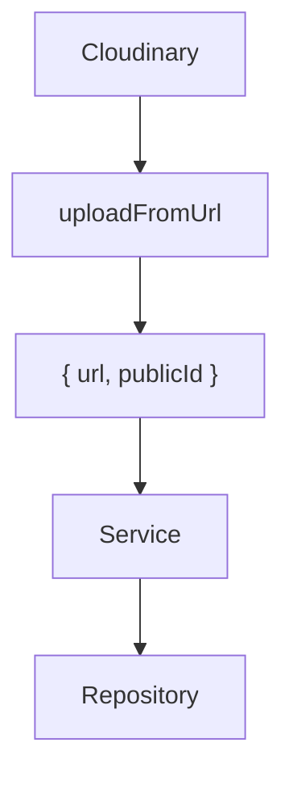
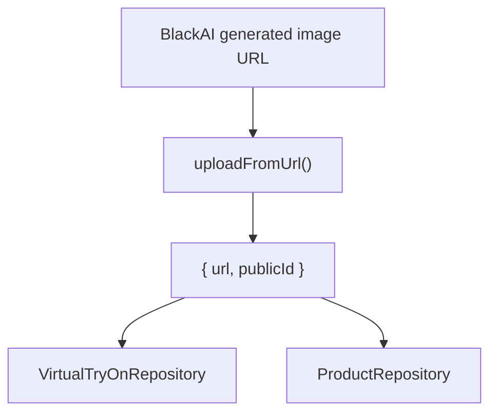

# Virtual Try-On Architecture

## Goal

The Virtual Try-On feature allows both `Users` and `Sellers` to generate AI-powered virtual try-ons while keeping the architecture:

- Easy to understand
- Easy to extend
- Easy to maintain

The controller is responsible only for determining who is making the request. All business logic lives inside the appropriate service.

## Overall Flow

```text
Controller
    |
    |-- UserVirtualTryOnService
    |
    \-- SellerVirtualTryOnService
```

## User Virtual Try-On Flow

```text
Controller
      |
      v
UserVirtualTryOnService
      |
      |-- Validate Prompt & Aspect Ratio
      |-- Resolve Model Image
      |-- Resolve Clothing Images
      |-- Repository Ownership Checks
      |-- Generate Outfit (BlackAI)
      |-- Upload Generated Image to Cloudinary
      |-- Create VirtualTryOn Document
      |-- Delete Temporary Uploads
      \-- Return Created Document
```

The User service coordinates the entire generation flow while delegating image resolution, database operations, and AI communication to dedicated components.

## Seller Virtual Try-On Flow

```text
Controller
      |
      v
SellerVirtualTryOnService
      |
      |-- Validate Prompt & Aspect Ratio
      |-- Resolve AI Model
      |-- Resolve Product Images
      |-- Repository Ownership Checks
      |-- Generate Outfit (BlackAI)
      |-- Upload Generated Image to Cloudinary
      |-- Store AI Preview in Product
      |-- Delete Temporary Uploads
      \-- Return Response
```

Unlike the User flow, the Seller flow stores the generated preview inside the primary `Product` instead of creating a separate `VirtualTryOn` document.

> [!NOTE]
> Only the first product receives the generated preview.
>
> This avoids storing duplicate AI previews across multiple products.

### Primary Product Requirement

Every Seller request must include `productId1`.

`productId1` acts as the primary product for the request.

Uploaded clothing images may still be used for any clothing slot, but they do not replace the need for a primary existing product.

The generated preview is always attached to the primary product.

This guarantees every generated preview has a permanent owner in the database.

## Image Resolution

### Image Source Resolver

The `imageSourceResolver()` has a single responsibility:

> Return an image regardless of where it originates.

Possible image sources include:

- Uploaded file
- `ClothingItem` (User flow)
- `Product` (Seller flow)

The resolver never performs database queries itself.

Instead, the service supplies a repository callback.

```ts
imageSourceResolver({
  filePath,
  docId,
  ownerId,
  fetchImage,
});
```

Every image source returns the same structure.

```ts
{
  url,
  publicId
}
```

Because every source shares the same return type, the services do not need separate logic for uploaded files and stored images.

### Model Image Resolver

Model images follow different rules than clothing images.

Resolution priority:

1. Uploaded model image
2. Existing User profile image
3. Existing Seller AI model image

If no valid model image can be resolved, the request is rejected.

Keeping this logic separate prevents the generic image resolver from becoming filled with role-specific conditions.

## External Services

### BlackAI Service

The BlackAI service is responsible only for communicating with `TheNewBlack`.

It receives already-resolved image URLs from the service.

It does not know anything about:

- MongoDB
- Cloudinary
- `ClothingItem` documents
- Users

Flow:

```text
UserService
      |
Prepared Image URLs
      |
      v
BlackAI Service
      |
HTTP Request
      |
      v
TheNewBlack
      |
Generated Image URL
      |
      v
Return URL
```

The service returns the generated image URL instead of a `Fetch Response` object.

This keeps the contract simple for the caller.

### Cloudinary Utility

The Cloudinary utility provides several helper functions:

#### Temporary Uploads

- Upload images that will be deleted after processing
- `uploadOnCloudinary()` currently returns Cloudinary's raw response

#### Permanent Uploads

- Upload images that become permanent assets
- Used for generated AI images

#### Upload Helper

```ts
uploadOnCloudinary(filePath, options)
```

#### Delete Helper

```ts
deleteFromCloudinary(publicId)
```

#### Upload from URL

```ts
uploadFromUrl(imageUrl, options)
```

This is used after receiving the generated image URL from BlackAI.

### Cloudinary Response Abstraction

One important improvement is that `uploadFromUrl()` now converts Cloudinary's raw response into the application's image object.

```ts
{
  url,
  publicId
}
```

That means:

- Services no longer understand Cloudinary response fields such as `secure_url` and `public_id`
- Repositories receive only application objects
- Cloudinary-specific details stay inside the Cloudinary utility



The Seller flow now follows the same image handling pattern as the User flow.

Both services receive the same application image object and pass that object to their repositories instead of manually extracting provider-specific fields.

## Generated Image Persistence

After BlackAI returns the generated image URL:

```text
BlackAI
      |
Generated Image URL
      |
      v
Cloudinary Upload (uploadFromUrl)
      |
      v
{
  url,
  publicId
}
      |
      v
Repository
      |
      v
MongoDB
```



The generated image is stored in Cloudinary instead of keeping the provider URL because:

- Cloudinary is our permanent storage
- External provider URLs may expire
- We maintain full control over the asset

Only the Cloudinary image object is stored inside MongoDB.

In the User flow, the object is stored inside the `VirtualTryOn` document.

In the Seller flow, the object is stored inside `Product.media.aiModelPreview`.

## Repository Responsibilities

Repositories have two responsibilities:

- Read and write MongoDB documents
- Enforce resource ownership

```text
Service
    |
    v
Image Resolver
    |
    v
Repository
    |
Ownership Check
    |
    v
MongoDB
```

Example:

```ts
Product.findOne({
  _id: productId,
  seller: ownerId,
});
```

Clothing items follow the same ownership pattern.

Ownership validation is hidden inside repositories, allowing services and resolvers to remain database-agnostic.

Repositories never interact with Cloudinary or BlackAI.

They only save and retrieve MongoDB documents.

The repository contract now stays infrastructure-agnostic.

For example, the Seller repository receives:

```ts
addVirtualTryOnImage(
  productId,
  sellerId,
  virtualTryOnImage
)
```

instead of receiving Cloudinary-specific fields such as:

```ts
addVirtualTryOnImage(
  productId,
  sellerId,
  secure_url,
  public_id
)
```

This keeps repositories focused only on persisting application data.

## Product Validation

The `Product` schema owns all business rules related to fit information.

Before saving, it validates that:

- Only one fit section contains data
- The selected product type matches the populated fit section
- Empty fit sections are removed automatically

This guarantees invalid product configurations never reach the database.

## Temporary Images

Images uploaded specifically for a single request are considered temporary.

Each temporary upload receives a Cloudinary `publicId`.

Note: Temporary resources are always cleaned up inside a finally block. Whether the request fails due to validation, a repository error, a missing service configuration, or a third-party service failure, Multer's temporary files and any temporary Cloudinary uploads are removed before the request exits. 

After the Virtual Try-On process finishes, the service removes every temporary upload inside a `finally` block.

```text
Temporary Upload
        |
        v
Cloudinary
        |
        v
Virtual Try-On Finished
        |
        v
Delete Temporary Images
```

Permanent images that belong to:

- `ClothingItem`
- `Product`
- `AI Model`
- Generated AI outfits

are never deleted.

> [!NOTE]
> Generated images are **not** deleted because they become permanent assets stored in Cloudinary.

## Layer Responsibilities

### Controller

- Receive the request
- Determine the authenticated role
- Call the correct service
- Return the response

### Service

- Execute the Virtual Try-On workflow
- Validate request data
- Coordinate resolvers
- Coordinate repositories
- Coordinate external services (`BlackAI`, `Cloudinary`)
- Work only with application image objects after helper abstraction
- Clean temporary uploads

### Resolver

- Decide where an image comes from
- Return a consistent image object
- Remain independent of database logic

### Repository

- Read MongoDB documents
- Update MongoDB documents
- Enforce ownership rules
- Hide persistence details
- Stay independent from storage-provider response formats

### BlackAI Service

- Receive prepared image URLs
- Generate the virtual try-on
- Return the generated image URL

### Cloudinary Utility

- Upload temporary images
- Upload permanent images
- Upload from URL
- Convert generated-image uploads into the application's image object
- Delete temporary uploads after processing

## Design Principles

The architecture follows several design principles:

- **Single Responsibility Principle**: each component has one job.
- **Dependency Injection**: repositories are supplied to resolvers.
- **Separation of Concerns**: controllers, services, resolvers, repositories, and external services each have clearly defined responsibilities.
- **Consistent Data Contracts**: image-related flows aim to return the same object structure.
- **Ownership Enforcement**: repositories ensure users can only access resources they own.
- **Automatic Cleanup**: temporary uploads are always deleted, even if generation fails.
- **Infrastructure Hiding**: helpers absorb provider-specific response formats so higher layers stay application-focused.
- **Permanent Ownership**: Every generated seller preview is attached to an existing `Product`, ensuring generated assets always have a permanent owner.
- **Independence**: repositories remain independent from external services.
