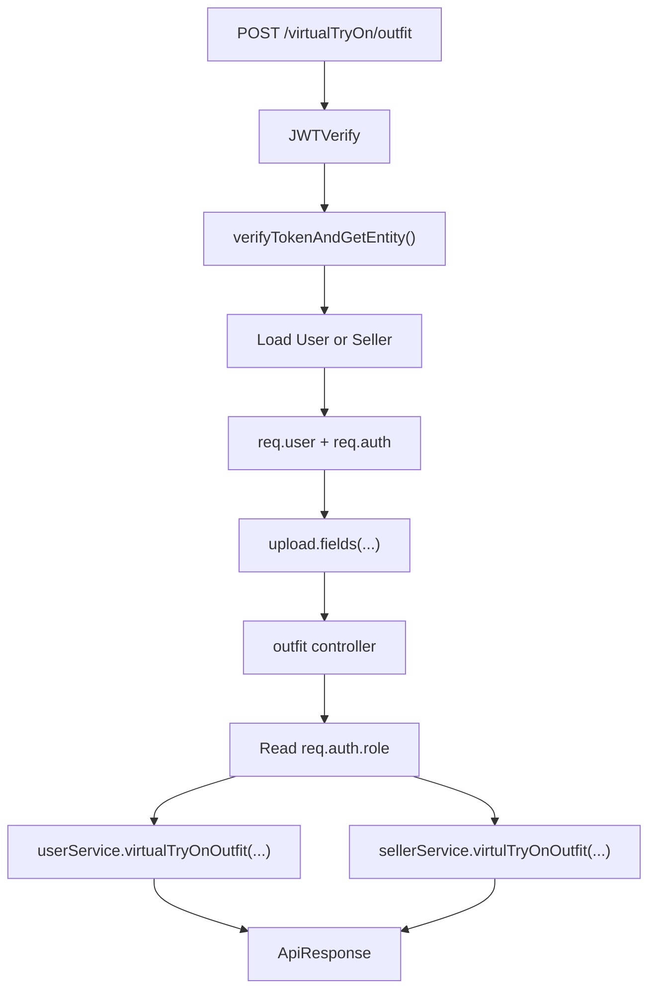
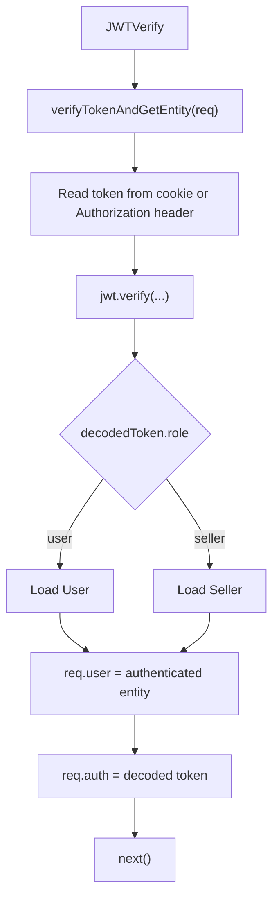
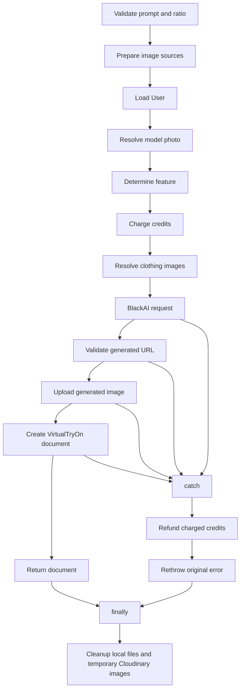
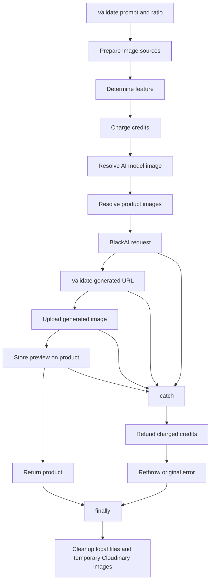
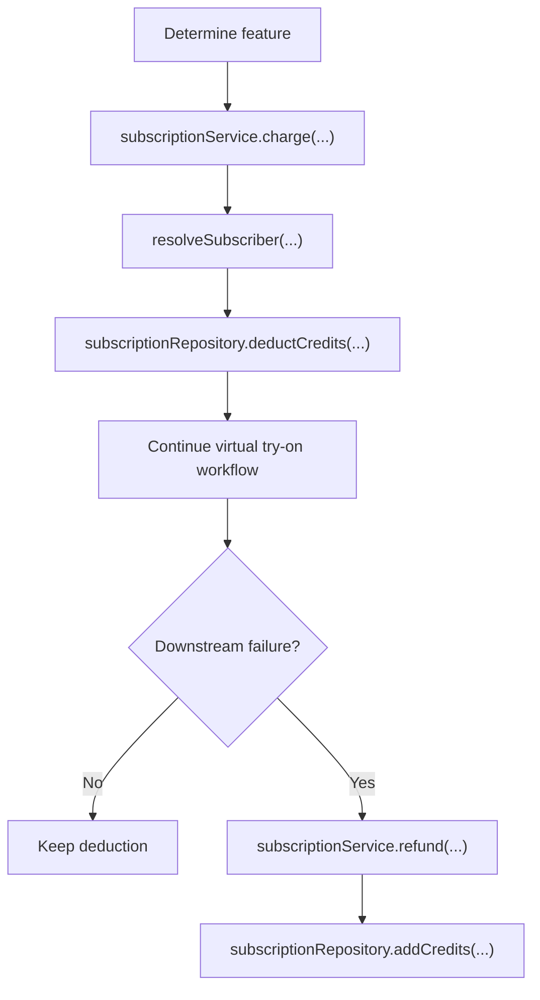
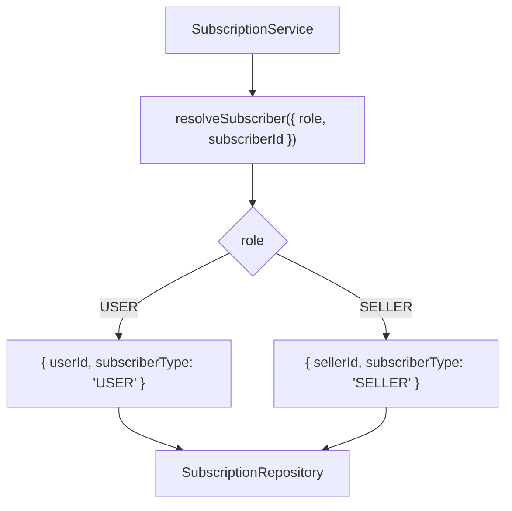
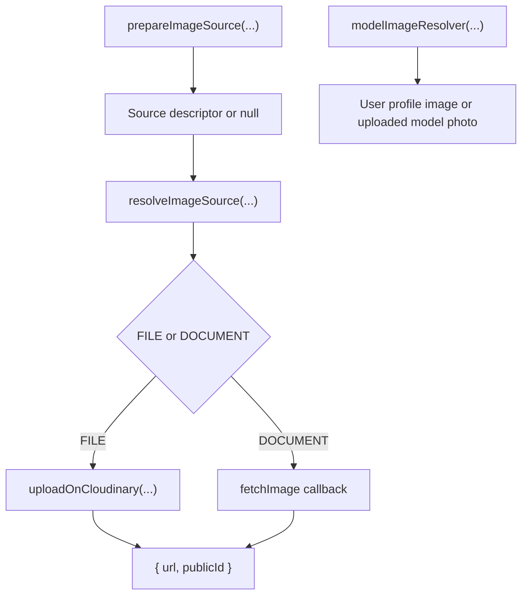
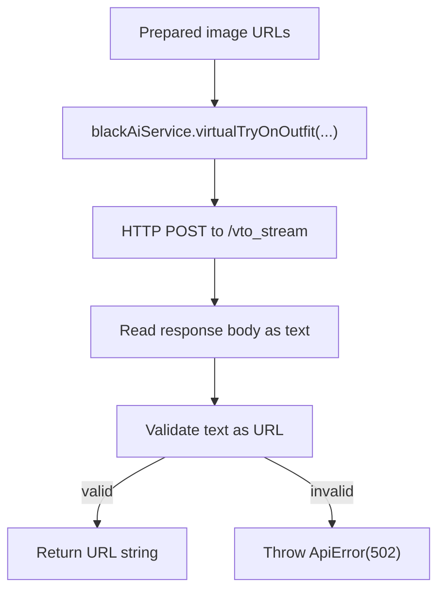
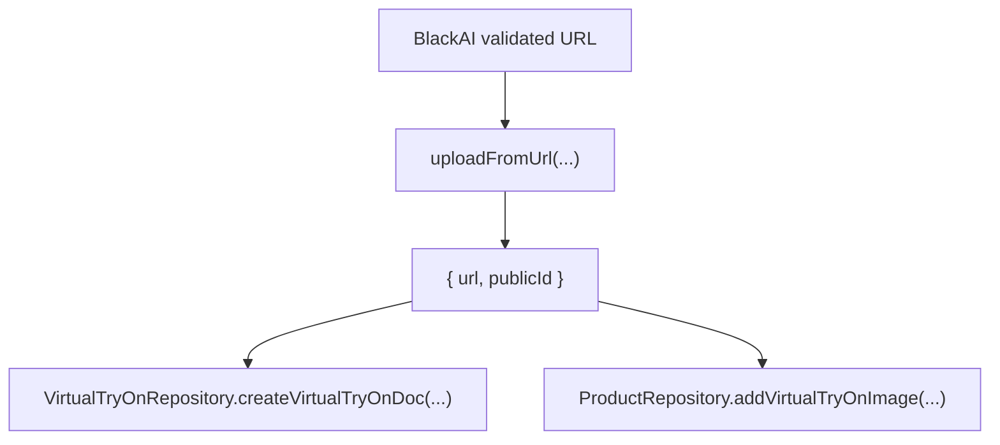
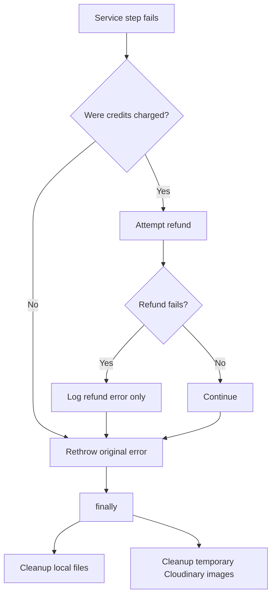

# Virtual Try-On Architecture

## Goal

The Virtual Try-On feature allows both `Users` and `Sellers` to generate AI-powered try-on results through a single HTTP endpoint while keeping responsibilities separated across middleware, controller, services, repositories, utilities, and external integrations.

This document reflects the current implementation exactly. The implementation is the source of truth.

## Entry Point

The feature is exposed through:

`POST /virtualTryOn/outfit`

Route definition:

- `JWTVerify` authenticates the caller and attaches identity to the request.
- `upload.fields(...)` parses optional multipart files for `cloth1`, `cloth2`, `cloth3`, and `modelPhoto`.
- `outfit` in `virtualTryOn.controller.js` reads the already-authenticated role from `req.auth.role` and delegates to the correct service.

## Overall Request Flow



One endpoint serves both roles. The controller does not implement business rules itself. It only maps request data, reads `req.auth.role`, and delegates to `UserService` or `SellerService`.

## Authentication Flow

Authentication is resolved before the controller runs.



### Current behavior

- `verifyTokenAndGetEntity()` accepts `accessToken`, `sellerAccessToken`, or a bearer token from the `Authorization` header.
- It verifies the JWT, inspects `decodedToken.role`, and loads either a `User` or `Seller`.
- The authenticated entity is stored in `req.user`.
- The decoded token is stored in `req.auth` by `JWTVerify`.
- The controller only reads `req.auth.role`.
- The services never determine identity from tokens. They receive identity as arguments from the controller.

This keeps authentication and role resolution in middleware instead of duplicating identity logic in services.

## Controller Responsibility

The `outfit` controller is intentionally thin.

### User branch

If `req.auth.role === "user"`:

- `clothId1`, `clothId2`, `clothId3`, `prompt`, and `ratio` are read from `req.body`.
- Uploaded files are mapped into:
  - `modelPhoto`
  - `cloth1`
  - `cloth2`
  - `cloth3`
- The controller calls `userService.virtualTryOnOutfit(...)`.
- `req.user._id` is passed as `userId`.

### Seller branch

If `req.auth.role === "seller"`:

- The same body fields are reused, but `clothId1`, `clothId2`, and `clothId3` are re-mapped to `productId1`, `productId2`, and `productId3`.
- Uploaded files are re-mapped to seller-specific names:
  - `modelPhoto`
  - `product1`
  - `product2`
  - `product3`
- `aiModelId` is also forwarded.
- The controller calls `sellerService.virtulTryOnOutfit(...)`.

### Response

Both branches return:

- HTTP `200`
- `ApiResponse`
- success message: `"Virtual try on generated successfully"`

If the role is neither `user` nor `seller`, the controller throws `ApiError(400, "Invalid User role")`.

## Service Split

The architecture uses two orchestration services behind one endpoint:

- `UserService` for user-owned clothing items and user profile/uploaded model photos.
- `SellerService` for seller-owned products and AI models.

The controller chooses the service; each service owns its role-specific workflow.

## User Virtual Try-On Flow



### Current user workflow

`userService.virtualTryOnOutfit(...)` currently performs the following steps:

1. Validate service availability by requiring `env.BLACK_AI_KEY`.
2. Validate `prompt`.
3. Validate `ratio`.
4. Build three clothing source descriptors with `prepareImageSource(...)`.
5. Resolve pricing with `getFeatureConfig({ role, feature: "VIRTUAL_TRY_ON" })`.
6. Load the user through `userRepository.findUserById(userId)`.
7. Resolve the model photo through `modelImageResolver(...)`.
8. Charge credits through `subscriptionService.charge(...)`.
9. Resolve `cloth1`, `cloth2`, and optional `cloth3` through `resolveImageSource(...)` using `clothingItemRepository.findClothImage(...)`.
10. Call `blackAiService.virtualTryOnOutfit(...)`.
11. Upload the generated image URL to Cloudinary with `uploadFromUrl(...)`.
12. Persist the result with `virtualTryOnRepository.createVirtualTryOnDoc(...)`.
13. Return the created `VirtualTryOn` document.
14. In `catch`, refund credits if they were charged.
15. In `finally`, run file cleanup and temporary-image cleanup.

## Seller Virtual Try-On Flow



### Current seller workflow

`sellerService.virtulTryOnOutfit(...)` currently performs the following steps:

1. Require `productId1`.
2. Validate `prompt`.
3. Validate `ratio`.
4. Validate service availability by requiring `env.BLACK_AI_KEY`.
5. Build the model source with `prepareImageSource(...)` from either uploaded `modelPhoto` or `aiModelId`.
6. Build up to three product source descriptors with `prepareImageSource(...)`.
7. Determine the charged feature with `determineSellerFeature(...)`.
8. Charge credits through `subscriptionService.charge(...)`.
9. Resolve the model photo with `resolveImageSource(...)` using `aiModelRepository.findModelImageUrl(...)`.
10. Resolve `product1`, optional `product2`, and optional `product3` with `resolveImageSource(...)` using `productRepository.findProductImageUrl(...)`.
11. Call `blackAiService.virtualTryOnOutfit(...)`.
12. Upload the generated image URL with `uploadFromUrl(...)`.
13. Store the resulting application image object with `productRepository.addVirtualTryOnImage(...)` on the primary product.
14. Return the updated product.
15. In `catch`, refund credits if they were charged.
16. In `finally`, run file cleanup and temporary-image cleanup.

## Primary Product Requirement

Every seller request must include `productId1`.

`productId1` is the primary product for the request:

- It guarantees there is always an existing product that owns the generated preview.
- The generated preview is pushed into `media.aiModelPreview` on that product.
- Additional uploaded product images or product IDs may be used for generation, but they do not replace the primary product requirement.

This is why the seller flow returns an updated `Product` instead of a separate `VirtualTryOn` document.

## Credit System

Credits are now part of the runtime workflow, not just the subscription subsystem.



### Charge flow

Both Virtual Try-On services charge before BlackAI generation begins.

The charge path is:

1. The service determines which feature applies.
2. The service calls `subscriptionService.charge({ role, subscriberId, feature })`.
3. `SubscriptionService` converts the role and ID into a subscription selector by calling `resolveSubscriber(...)`.
4. `SubscriptionService` calls `subscriptionRepository.deductCredits(...)`.
5. `SubscriptionRepository` performs an atomic `findOneAndUpdate(...)` with:
   - the subscriber selector
   - `credits: { $gte: cost }`
   - `$inc: { credits: -cost }`

This condition ensures the decrement only happens when enough credits already exist. Because the update and the balance guard are in the same database operation, the implementation avoids deducting into a negative balance.

If no matching subscription is found with enough credits, `SubscriptionService` throws `ApiError(402, "Insufficient credits")`.

### Refund flow

If credits were charged and any downstream step fails, both services attempt:

`subscriptionService.refund({ role, subscriberId, cost: chargedCredits.chargedCost })`

Refunds happen inside the service `catch` block:

- only after a successful charge
- before the original error is rethrown
- without replacing the original business error if refunding itself fails

Refund failures are logged as `"Refund Error"` and the original failure is preserved.

## Feature Pricing

Feature pricing is centralized in `src/config/featurePricing.js`.

### FEATURE_PRICING

`FEATURE_PRICING` defines role-specific feature metadata:

- title
- cost
- description

Current values:

- `USER -> VIRTUAL_TRY_ON`
- `SELLER -> AI_MODEL_GENERATION`
- `SELLER -> VIRTUAL_TRY_ON`
- `SELLER -> PRODUCT_TRY_ON`

### getFeatureConfig()

`getFeatureConfig({ role, feature })`:

- normalizes both values to uppercase
- validates them
- looks up the pricing entry
- returns:

```ts
{
  code,
  title,
  cost,
  description
}
```

### determineSellerFeature()

`determineSellerFeature({ products })` chooses seller pricing based on the number of prepared product sources:

- exactly `1` product source -> `SELLER -> VIRTUAL_TRY_ON`
- more than `1` product source -> `SELLER -> PRODUCT_TRY_ON`

### Current role behavior

- Users always use `USER -> VIRTUAL_TRY_ON`.
- Sellers automatically switch between `VIRTUAL_TRY_ON` and `PRODUCT_TRY_ON` depending on how many product sources are present.

This keeps pricing logic centralized in configuration instead of duplicating pricing rules inside services.

## Subscription Role Resolution

Role-to-subscriber mapping is centralized in `src/utils/role.resolver.js`.



`resolveSubscriber(...)` returns the repository selector used by subscription operations:

- `USER` -> `{ userId: subscriberId, subscriberType: "USER" }`
- `SELLER` -> `{ sellerId: subscriberId, subscriberType: "SELLER" }`

This centralizes role resolution so:

- subscription services do not handcraft query selectors repeatedly
- charging and refunding follow the same contract
- repository calls stay consistent regardless of caller role

## Image Resolution

Image resolution is intentionally split into three layers.



### prepareImageSource()

`prepareImageSource({ filePath, docId, required = true })` is a validation and normalization step.

Responsibilities:

- accept a local uploaded file path or a document ID
- reject requests that provide both at the same time
- reject requests that provide neither when the source is required
- allow `null` when the source is optional
- return a normalized source descriptor:

```ts
{ type: "FILE", value: filePath }
```

or

```ts
{ type: "DOCUMENT", value: docId }
```

It exists separately from `resolveImageSource()` because the implementation first validates and normalizes request input, then resolves it later inside the business workflow. This separation lets the service:

- prepare all source decisions early
- determine pricing before every document lookup is executed
- pass consistent source descriptors into shared resolution logic

### resolveImageSource()

`resolveImageSource({ source, ownerId, fetchImage })` performs the actual resolution.

Responsibilities:

- return `null` for optional missing sources
- for `FILE`, upload the local file using `uploadOnCloudinary(...)`
- for `DOCUMENT`, call the injected `fetchImage(...)` callback
- return a consistent application image object:

```ts
{
  url,
  publicId
}
```

### Callback injection

`resolveImageSource()` never imports repositories directly. The caller injects a callback such as:

- `clothingItemRepository.findClothImage.bind(clothingItemRepository)`
- `productRepository.findProductImageUrl.bind(productRepository)`
- `aiModelRepository.findModelImageUrl.bind(aiModelRepository)`

This preserves resolver reuse and keeps storage ownership rules in repositories rather than inside the resolver.

### Ownership validation

Ownership checks happen when the callback reaches the repository:

- `ClothingItemRepository.findClothImage(id, ownerId)` requires `owner: ownerId`
- `ProductRepository.findProductImageUrl(id, ownerId)` requires `seller: ownerId`

The resolver passes `ownerId` through, but the repository decides what ownership rule to apply.

### modelImageResolver()

`modelImageResolver({ user, filePath })` is intentionally separate from generic image resolution because the user model photo follows different fallback rules:

- if an uploaded model file exists, upload it and return `{ url, publicId }`
- otherwise use `user.image.secureUrl`
- if neither exists, throw `ApiError(400, ...)`

This keeps user model-photo fallback logic out of the generic resolver path.

## BlackAI Integration

The BlackAI integration no longer returns a raw `fetch` response to services.



### Current behavior

`blackAiService.virtualTryOnOutfit(...)`:

- builds a `FormData` payload
- sends a POST request to `https://thenewblack.ai/api/1.1/wf/vto_stream`
- reads the response body as trimmed text
- validates that the returned text is a valid URL with `new URL(text)`
- returns the validated URL string
- throws `ApiError(502, "Black AI returned an invalid image URL")` when validation fails

### Why validation lives here

URL validation belongs in the integration layer because this is the boundary where provider-specific response rules are understood.

That keeps services focused on orchestration:

- services prepare inputs
- the integration hides HTTP details and provider response shape
- callers receive one stable contract: a generated image URL string or an exception

## Cloudinary

Cloudinary utilities handle both temporary uploads and permanent generated-image uploads.

### uploadOnCloudinary()

`uploadOnCloudinary(localFilePath)`:

- uploads a local file to Cloudinary
- uses `resource_type: "auto"`
- deletes the local temporary file with `fs.unlinkSync(...)`
- returns Cloudinary's raw upload response

This is used for temporary request-scoped uploads such as:

- user-uploaded clothing images
- seller-uploaded product images
- uploaded model photos

The resolver then converts the raw response into the application image object:

```ts
{
  url: image.secure_url,
  publicId: image.public_id
}
```

### uploadFromUrl()

`uploadFromUrl(fileUrl)`:

- uploads the generated provider URL into Cloudinary
- returns the application image object:

```ts
{
  url,
  publicId
}
```

This function is used for generated images that become permanent application assets.

### Why uploadFromUrl() returns an application image object

The current implementation converts the Cloudinary response into:

```ts
{
  url,
  publicId
}
```

so that:

- services do not depend on `secure_url` and `public_id`
- repositories receive application-level data
- Cloudinary field names stay hidden in the utility layer

### deleteFromCloudinary()

`deleteFromCloudinary(publicID, resourceType)`:

- validates `publicID`
- calls Cloudinary deletion
- treats `"not found"` as non-fatal
- throws `ApiError(502, "Cloudinary service unavailable")` on provider failure

### Temporary uploads vs generated uploads

Temporary uploads:

- originate from request files
- are uploaded only to prepare input images for generation
- are tracked using returned `publicId`
- are cleaned up in `finally`

Generated uploads:

- originate from the BlackAI returned URL
- are uploaded through `uploadFromUrl(...)`
- become permanent records
- are stored either on a `VirtualTryOn` document or inside `Product.media.aiModelPreview`
- are not included in cleanup

## Generated Image Persistence



The provider URL is not stored directly. The application first re-hosts the image in Cloudinary, then persists the Cloudinary-backed application image object.

Current persistence targets:

- User flow -> `VirtualTryOn.virtualTryOnImage`
- Seller flow -> `Product.media.aiModelPreview`

## Repository Responsibilities

Repositories hide MongoDB access from services.

Services do not write Mongo queries directly. Instead, repositories encapsulate:

- document lookup
- update logic
- ownership constraints where applicable
- persistence contracts

### UserRepository

`findUserById(id)`:

- loads a user by ID
- throws `ApiError(404, "User not found")` if missing

This repository resolves existence for the user flow before model-photo fallback logic runs.

### ProductRepository

`findProductImageUrl(id, ownerId)`:

- performs `findOne({ _id: id, seller: ownerId })`
- enforces seller ownership
- returns `{ url, publicId: null }`

`addVirtualTryOnImage(id, sellerId, virtualTryOnImage)`:

- performs `findOneAndUpdate({ _id: id, seller: sellerId }, ...)`
- pushes the image into `media.aiModelPreview`
- enforces seller ownership during the write path

### ClothingItemRepository

`findClothImage(id, ownerId)`:

- performs `findOne({ _id: id, owner: ownerId })`
- enforces user ownership
- returns `{ url, publicId: null }`

### AIModelRepository

`findModelImageUrl(id)`:

- loads the AI model by ID
- throws `ApiError(404, "AiModel not found")` if missing
- returns the first model-media image as `{ url, publicId: null }`

In the current implementation this method resolves by model ID and does not receive `ownerId`.

### SubscriptionRepository

`deductCredits({ subscriber, cost })`:

- performs the atomic credit deduction
- guards with `credits: { $gte: cost }`

`addCredits({ subscriber, cost })`:

- increments credits during refunds

`create(...)`, `activate(...)`, and `get(...)` encapsulate subscription persistence outside the Virtual Try-On flow as well.

### VirtualTryOnRepository

`createVirtualTryOnDoc(...)`:

- creates the final user-owned `VirtualTryOn` record
- persists already-prepared application data

Because query construction stays inside repositories, service code remains focused on workflow instead of MongoDB details.

## Subscription and Plans

Virtual Try-On charging depends on the subscription subsystem.

### SubscriptionService

`SubscriptionService` centralizes:

- order creation
- plan activation
- current-plan lookup
- credit deduction
- credit refunding

For Virtual Try-On specifically, the key methods are:

- `charge(...)`
- `refund(...)`

Both methods route through `resolveSubscriber(...)` before calling `SubscriptionRepository`.

### SubscriptionRepository

`SubscriptionRepository` owns persistence for:

- subscription creation
- activation/upsert
- lookup
- credit decrement
- credit increment

### Subscription plan configuration

`src/config/subscriptionPlans.js` contains plan definitions per role:

- `USER -> FREE`, `PRO`
- `SELLER -> FREE`, `PRO`, `BRAND`

Plan configuration controls:

- amount
- credits
- currency

Feature pricing controls per-operation credit cost, while subscription plans control how many credits a subscriber owns.

## Error Recovery

Error recovery is explicit in both services.



### Validation errors

Validation errors happen before charging when they occur in:

- prompt validation
- aspect-ratio validation
- image-source preparation
- required primary-product checks
- missing BlackAI configuration

In those cases, no credits are charged, so no refund runs.

### Generation and downstream errors

If a failure happens after charging, such as during:

- repository-based image resolution
- BlackAI generation
- generated-image upload
- persistence

the service:

1. attempts a refund
2. logs refund failures only
3. rethrows the original error
4. still executes cleanup in `finally`

### Refund failures

Refund failures never replace the original business error. They are logged with `console.error("Refund Error", error)`.

### Cleanup failures

Cleanup failures also never replace the original business error.

`cleanupFiles(...)` and `cleanupImages(...)` catch and log their own failures internally, so cleanup remains best-effort.

## Cleanup

Cleanup is performed in `finally` blocks in both services.

### cleanupFiles()

`cleanupFiles(temporaryFiles)`:

- expects an array
- checks whether a local file still exists
- removes it with `fs.unlinkSync(...)`
- logs errors without throwing

This handles request-local files that may still remain on disk.

### cleanupImages()

`cleanupImages(temporaryImages)`:

- expects an array
- iterates over resolved image objects
- deletes only entries that have a `publicId`
- logs Cloudinary cleanup failures without throwing

This means only temporary Cloudinary uploads are deleted. Repository-backed images return `publicId: null`, so permanent images are not removed.

### Why cleanup is best-effort

Cleanup exists to remove temporary infrastructure artifacts, not to redefine business outcomes. That is why:

- cleanup runs in `finally`
- cleanup utilities swallow and log their own failures
- cleanup errors never override the actual application error that caused the request to fail

## Layer Responsibilities

### Route

- exposes `/virtualTryOn/outfit`
- applies authentication middleware
- applies multipart file parsing
- forwards the request to the controller

### Authentication Middleware

- verifies the token
- resolves whether the caller is a user or seller
- loads the authenticated entity
- stores `req.user` and `req.auth`

### Controller

- reads request fields
- maps file inputs
- reads `req.auth.role`
- delegates to the correct service
- formats the HTTP response

### Services

- validate request inputs
- prepare source descriptors
- determine pricing
- charge and refund credits
- orchestrate repositories, resolvers, BlackAI, and Cloudinary
- persist final output
- execute cleanup in `finally`

### Resolvers

- normalize source choices
- resolve uploaded files or persisted images into a common application image object
- stay independent from Mongo query construction

### Repositories

- perform Mongo reads and writes
- enforce ownership where implemented
- hide query details from services

### BlackAI Service

- handles the HTTP integration with TheNewBlack
- validates provider output as a URL
- returns a URL string or throws

### Cloudinary Utility

- uploads temporary input files
- uploads generated output URLs
- deletes temporary Cloudinary resources
- converts generated-image uploads into the application image object

## Product Validation

The `Product` schema remains responsible for fit-specific product validation.

Before save, it enforces product fit consistency rules such as:

- only one fit section containing data
- matching selected product type
- removing empty fit sections

These rules are separate from the Virtual Try-On orchestration but still shape the correctness of seller-owned product data.

## Design Principles

The current architecture follows these principles:

- **Single Responsibility**: middleware authenticates, controllers delegate, services orchestrate, repositories persist, utilities encapsulate infrastructure details.
- **Dependency Injection**: repositories are injected into `resolveImageSource(...)` through callbacks instead of being hardcoded into the resolver.
- **Compensation Pattern (Refund)**: credits are refunded when a charged workflow fails downstream.
- **Infrastructure Hiding**: services work with application image objects instead of Cloudinary response fields or raw provider HTTP responses.
- **Ownership Enforcement**: repositories such as `ProductRepository` and `ClothingItemRepository` enforce owner-based access in their queries.
- **Provider Validation**: the BlackAI integration validates that the provider returned a usable URL before handing control back to services.
- **Fail Fast**: invalid prompt, invalid ratio, invalid image-source combinations, missing required sources, and missing configuration fail before expensive processing continues.
- **Consistent Contracts**: image resolution converges on `{ url, publicId }` so higher layers can coordinate one shape.
- **Best Effort Cleanup**: cleanup always runs and logs failures without overriding business results.
- **Centralized Feature Pricing**: feature cost and metadata are defined in `FEATURE_PRICING` and selected through shared helpers.
- **Role Resolution**: subscriber query shape is derived centrally by `resolveSubscriber(...)`.
- **Thin Controller**: the controller chooses the service and returns the response; business logic remains outside the HTTP layer.
- **Layer Isolation**: services do not write Mongo queries, repositories do not call BlackAI, and resolvers do not know Mongo schemas.
- **Permanent Ownership**: seller-generated previews are always attached to an existing primary product.

## Summary of Current Persistence Targets

- User result -> a new `VirtualTryOn` document
- Seller result -> an updated `Product` with a pushed `media.aiModelPreview` entry
- Temporary request files -> removed locally
- Temporary Cloudinary uploads -> deleted in cleanup when `publicId` exists
- Generated Cloudinary assets -> retained as permanent application data
