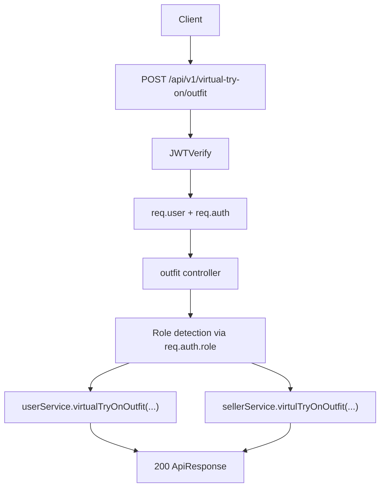
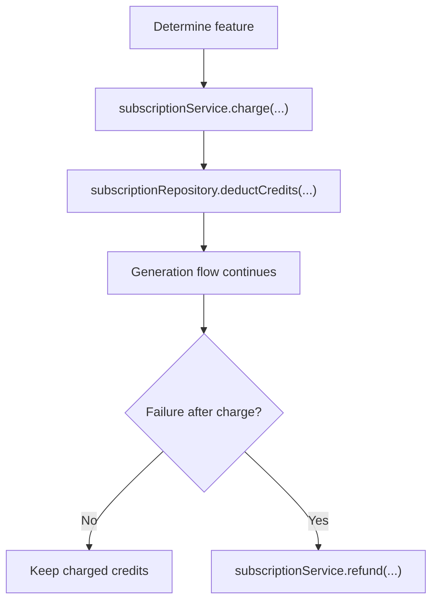
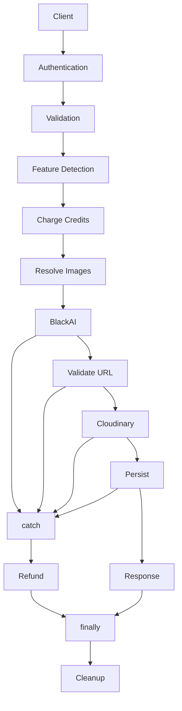

# Virtual Try-On API

## Endpoint

```http
POST /api/v1/virtual-try-on/outfit
```

### Request format

- Content type: `multipart/form-data`
- Authentication: required
- Supported roles: `USER`, `SELLER`
- Route middleware:
  - `JWTVerify`
  - `upload.fields([{ name: "cloth1" }, { name: "cloth2" }, { name: "cloth3" }, { name: "modelPhoto" }])`

### JWT authentication flow

The endpoint accepts authentication from:

- `Authorization: Bearer <token>`
- `accessToken` cookie
- `sellerAccessToken` cookie

`JWTVerify`:

1. extracts the token
2. verifies it with `jwt.verify(...)`
3. reads the token role
4. loads the authenticated `User` or `Seller`
5. stores the loaded entity in `req.user`
6. stores the decoded token in `req.auth`

The controller reads `req.auth.role` to choose the service branch.

## Route Flow



## Authentication

### Supported authentication methods

- Bearer token in the `Authorization` header
- Cookie authentication through `accessToken`
- Cookie authentication through `sellerAccessToken`

### Request state after authentication

- `req.auth`: decoded JWT payload
- `req.user`: authenticated `User` or `Seller` document

### Supported roles

- `USER`
- `SELLER`

If the token is missing, invalid, expired, or points to a missing entity, the request is rejected before the controller runs.

## Request Body

The endpoint is a single HTTP route, but the request contract differs by role.

## User Request

The controller reads these fields from `multipart/form-data` for user requests.

| Name | Type | Required | Description | Accepted source |
| --- | --- | --- | --- | --- |
| `prompt` | `string` | Yes | Natural-language styling prompt sent to BlackAI. Must be a non-empty string with at least 50 characters and at least 8 words, and it must not contain banned NSFW terms. | Text field |
| `ratio` | `string` | No | Output aspect ratio. If omitted, the validator defaults it to `"1:1"`. Supported values: `21:9`, `16:9`, `9:16`, `4:3`, `3:4`, `3:2`, `2:3`, `4:5`, `5:4`, `1:1`. | Text field |
| `clothId1` | `string` | Conditionally required | Existing `ClothingItem` ID for clothing slot 1. Required if file `cloth1` is not uploaded. | Existing document ID |
| `clothId2` | `string` | Conditionally required | Existing `ClothingItem` ID for clothing slot 2. Required if file `cloth2` is not uploaded. | Existing document ID |
| `clothId3` | `string` | No | Existing `ClothingItem` ID for clothing slot 3. Optional alternative to uploaded file `cloth3`. | Existing document ID |
| `modelPhoto` | `file` | No | Uploaded model image. If omitted, the service falls back to the authenticated user's profile image at `user.image.secureUrl`. | Uploaded file |
| `cloth1` | `file` | Conditionally required | Uploaded clothing image for slot 1. Required if `clothId1` is not provided. | Uploaded file |
| `cloth2` | `file` | Conditionally required | Uploaded clothing image for slot 2. Required if `clothId2` is not provided. | Uploaded file |
| `cloth3` | `file` | No | Uploaded clothing image for slot 3. Optional alternative to `clothId3`. | Uploaded file |

### User model image resolution priority

```text
modelPhoto upload
    |
    v
user profile image
```

If neither source exists, the request fails with HTTP `400`.

## Seller Request

The HTTP request still uses `clothId1`, `clothId2`, and `clothId3` in the multipart body. The controller remaps them internally to `productId1`, `productId2`, and `productId3` before calling the seller service.

| Name | Type | Required | Description | Accepted source |
| --- | --- | --- | --- | --- |
| `prompt` | `string` | Yes | Natural-language styling prompt sent to BlackAI. Must be a non-empty string with at least 50 characters and at least 8 words, and it must not contain banned NSFW terms. | Text field |
| `ratio` | `string` | No | Output aspect ratio. If omitted, the validator defaults it to `"1:1"`. Supported values: `21:9`, `16:9`, `9:16`, `4:3`, `3:4`, `3:2`, `2:3`, `4:5`, `5:4`, `1:1`. | Text field |
| `clothId1` | `string` | Yes | Primary product identifier at the HTTP boundary. The controller remaps it to `productId1`. The seller service rejects the request before image resolution if this field is missing. | Existing document ID |
| `clothId2` | `string` | No | Optional secondary product identifier at the HTTP boundary. The controller remaps it to `productId2`. | Existing document ID |
| `clothId3` | `string` | No | Optional tertiary product identifier at the HTTP boundary. The controller remaps it to `productId3`. | Existing document ID |
| `aiModelId` | `string` | Conditionally required | Existing `AIModel` ID used for the seller model image when `modelPhoto` is not uploaded. | Existing document ID |
| `modelPhoto` | `file` | Conditionally required | Uploaded model image. Takes priority over `aiModelId`. | Uploaded file |
| `cloth1` | `file` | No | Uploaded product image for slot 1. The controller remaps it to `product1`, but in the current implementation it cannot replace `clothId1`, and supplying both `cloth1` and `clothId1` causes a validation error because only one source is allowed for the slot. | Uploaded file |
| `cloth2` | `file` | No | Uploaded product image for slot 2. The controller remaps it to `product2`. | Uploaded file |
| `cloth3` | `file` | No | Uploaded product image for slot 3. The controller remaps it to `product3`. | Uploaded file |

### Seller model image resolution priority

```text
modelPhoto upload
    |
    v
existing aiModelId
```

If neither source exists, the request fails with HTTP `400`.

## Image Source Rules

Each image slot accepts one source only.

Allowed pattern:

- existing document ID
- or uploaded file

Disallowed pattern:

- existing document ID and uploaded file together for the same slot

This rule is enforced by `prepareImageSource(...)`.

### User image slots

- Slot 1: `clothId1` or `cloth1`
- Slot 2: `clothId2` or `cloth2`
- Slot 3: `clothId3` or `cloth3`

### Seller image slots

- Model slot: `aiModelId` or `modelPhoto`
- Product slot 1: `clothId1` is required in the current implementation; `cloth1` is parsed but cannot replace it
- Product slot 2: `clothId2` or `cloth2`
- Product slot 3: `clothId3` or `cloth3`

### Valid examples

```text
User slot 1:
clothId1
OR
cloth1
```

```text
Seller model slot:
aiModelId
OR
modelPhoto
```

```text
Seller slot 2:
clothId2
OR
cloth2
```

If both sources are supplied for the same slot, the request fails with:

- HTTP `400`
- message: `"Only one image source is allowed"`

If a required slot has neither source, the request fails with:

- HTTP `400`
- message: `"Image source is required"`

## Model Image Resolution

## User

The user flow resolves the model image with `modelImageResolver(...)`:

1. uploaded `modelPhoto`
2. authenticated user's profile image at `user.image.secureUrl`

If neither exists, `modelImageResolver(...)` throws HTTP `400`.

## Seller

The seller flow resolves the model image with `prepareImageSource(...)` and `resolveImageSource(...)`:

1. uploaded `modelPhoto`
2. existing `aiModelId`

If neither exists, `prepareImageSource(...)` rejects the request with HTTP `400`.

Uploaded model photos always take priority over stored model references.

## Product / Clothing Resolution

Image ownership is validated in repositories during document-based resolution.

### User clothing ownership

`clothingItemRepository.findClothImage(id, ownerId)` performs:

```ts
ClothingItem.findOne({
  _id: id,
  owner: ownerId
})
```

This means:

- the clothing item must exist
- the clothing item must belong to the authenticated user

Otherwise the request fails with HTTP `404`.

### Seller product ownership

`productRepository.findProductImageUrl(id, ownerId)` performs:

```ts
Product.findOne({
  _id: id,
  seller: ownerId
})
```

This means:

- the product must exist
- the product must belong to the authenticated seller

Otherwise the request fails with HTTP `404`.

### Seller AI model lookup

`aiModelRepository.findModelImageUrl(id)` loads the AI model by ID and returns the first `modelMedia` URL. In the current implementation it validates existence but does not enforce seller ownership in the repository query.

## Feature Pricing

Pricing is centralized in `src/config/featurePricing.js`.

### User pricing

The user flow always charges:

`USER -> VIRTUAL_TRY_ON`

Current configuration:

- title: `Virtual Try-On`
- cost: `40`

### Seller pricing

The seller flow uses `determineSellerFeature({ products })`.

Pricing rules:

- exactly 1 prepared product source -> `SELLER -> VIRTUAL_TRY_ON`
- more than 1 prepared product source -> `SELLER -> PRODUCT_TRY_ON`

Current configuration:

- `SELLER -> VIRTUAL_TRY_ON` cost: `20`
- `SELLER -> PRODUCT_TRY_ON` cost: `60`

Because feature selection runs through centralized helpers, services do not hardcode credit costs.

## Credits

Credits are deducted before BlackAI generation and refunded if a charged workflow fails later.



### Charge behavior

Both services call:

```ts
subscriptionService.charge({
  role,
  subscriberId,
  feature
})
```

The charge path:

1. resolves the subscriber from role
2. calls `subscriptionRepository.deductCredits(...)`
3. performs an atomic decrement only if `credits >= cost`

If deduction cannot be performed, the request fails with:

- HTTP `402`
- message: `"Insufficient credits"`

### Refund behavior

If credits were charged and a later step fails, both services attempt:

```ts
subscriptionService.refund({
  role,
  subscriberId,
  cost
})
```

Refunds are attempted for downstream failures such as:

- BlackAI failure
- invalid BlackAI URL response
- Cloudinary upload failure
- repository persistence failure
- repository lookup failure after charging

Validation failures that occur before charging do not trigger refunds.

Refund failures are logged and do not replace the original business error.

## BlackAI

The services send prepared image URLs and validated text inputs to `blackAiService.virtualTryOnOutfit(...)`.

### Integration request

BlackAI receives:

- `model_photo`
- `clothing_photo`
- optional `clothing_photo_2`
- optional `clothing_photo_3`
- `prompt`
- `ratio`

The request is sent as `FormData` to:

```http
POST https://thenewblack.ai/api/1.1/wf/vto_stream?api_key=<BLACK_AI_KEY>
```

### Integration response

The integration reads the response body as text and expects it to be a generated image URL.

### URL validation

The integration validates the returned text with `new URL(text)`.

If validation succeeds:

- the service returns the URL string to the caller

If validation fails:

- HTTP `502`
- message: `"Black AI returned an invalid image URL"`

## Cloudinary

Cloudinary is used for both temporary request-scoped uploads and permanent generated-image storage.

### Temporary uploads

Uploaded request files such as:

- `modelPhoto`
- `cloth1`
- `cloth2`
- `cloth3`

are uploaded through `uploadOnCloudinary(...)` when a slot uses a file source.

The resolver converts the Cloudinary upload response into:

```ts
{
  url,
  publicId
}
```

These uploads are temporary and are deleted during cleanup if a `publicId` exists.

### Generated image uploads

After BlackAI returns a valid image URL, the service calls:

```ts
uploadFromUrl(generatedImageUrl)
```

`uploadFromUrl()`:

- uploads the generated image URL to Cloudinary
- converts the Cloudinary response into:

```ts
{
  url,
  publicId
}
```

- returns that application image object to the service

### Cleanup

Cleanup runs in each service `finally` block:

- `cleanupFiles(...)` removes leftover local files
- `cleanupImages(...)` deletes temporary Cloudinary uploads that have a `publicId`

Cleanup is best-effort:

- cleanup errors are logged
- cleanup errors do not override the main success or failure outcome

### Generated image persistence

Generated images uploaded through `uploadFromUrl()` are permanent application assets. They are persisted and are not included in temporary cleanup.

## Persistence

Persistence differs by role.

## User persistence

The user flow stores the result in a new `VirtualTryOn` document:

```json
{
  "_id": "6877e3d7f5b7f8d25df81a01",
  "owner": "6877d4a8f5b7f8d25df819d0",
  "cloth1": "6877d982f5b7f8d25df819f3",
  "cloth2": "6877d996f5b7f8d25df819f8",
  "cloth3": "6877d9abf5b7f8d25df819fb",
  "virtualTryOnImage": {
    "url": "https://res.cloudinary.com/demo/image/upload/v1721140000/virtual-try-on/user-look.png",
    "publicId": "virtual-try-on/user-look"
  },
  "createdAt": "2026-07-16T13:14:31.000Z",
  "updatedAt": "2026-07-16T13:14:31.000Z"
}
```

Persistence target:

- `VirtualTryOn.virtualTryOnImage`

## Seller persistence

The seller flow stores the generated image object on the primary product:

- `Product.media.aiModelPreview`

The updated product document is returned after the new preview is pushed.

## Success Responses

Both branches return HTTP `200` and the same response wrapper:

```json
{
  "data": {},
  "statusCode": 200,
  "message": "Virtual try on generated successfully",
  "success": true
}
```

The shape of `data` depends on the authenticated role.

## User Response

`data` is the newly created `VirtualTryOn` document.

### Example

```json
{
  "data": {
    "_id": "6877e3d7f5b7f8d25df81a01",
    "owner": "6877d4a8f5b7f8d25df819d0",
    "cloth1": "6877d982f5b7f8d25df819f3",
    "cloth2": "6877d996f5b7f8d25df819f8",
    "cloth3": "6877d9abf5b7f8d25df819fb",
    "virtualTryOnImage": {
      "url": "https://res.cloudinary.com/demo/image/upload/v1721140000/virtual-try-on/user-look.png",
      "publicId": "virtual-try-on/user-look"
    },
    "createdAt": "2026-07-16T13:14:31.000Z",
    "updatedAt": "2026-07-16T13:14:31.000Z"
  },
  "statusCode": 200,
  "message": "Virtual try on generated successfully",
  "success": true
}
```

## Seller Response

`data` is the updated `Product` document.

### Example

```json
{
  "data": {
    "_id": "6877f385f5b7f8d25df81a31",
    "seller": "6877cfb7f5b7f8d25df819c2",
    "type": "upper",
    "category": "shirt",
    "fitData": {
      "fitType": "regular",
      "upper": {
        "chest": 40,
        "waist": 36,
        "shoulder": 18,
        "sleeveLength": 24,
        "length": 29
      }
    },
    "color": "white",
    "colorGroup": "neutral",
    "season": ["summer"],
    "occasion": "casual",
    "media": {
      "productImages": [
        {
          "url": "https://res.cloudinary.com/demo/image/upload/v1721139000/products/shirt-front.png",
          "publicId": "products/shirt-front"
        }
      ],
      "aiModelPreview": [
        {
          "url": "https://res.cloudinary.com/demo/image/upload/v1721140500/virtual-try-on/seller-preview.png",
          "publicId": "virtual-try-on/seller-preview"
        }
      ]
    },
    "isActive": true,
    "isPublished": false,
    "createdAt": "2026-07-16T13:00:00.000Z",
    "updatedAt": "2026-07-16T13:15:00.000Z"
  },
  "statusCode": 200,
  "message": "Virtual try on generated successfully",
  "success": true
}
```

The response shape differs because:

- user flow creates a separate `VirtualTryOn` document
- seller flow updates and returns the primary `Product`

## Error Responses

| Status | Reason | Common Causes |
| --- | --- | --- |
| `400` | Bad Request | Missing required string fields, empty strings, invalid aspect ratio, prompt shorter than 50 characters, prompt with fewer than 8 words, banned prompt content, both file and document ID provided for one slot, no valid image source for a required slot, seller request without primary product, no user model source available. |
| `401` | Unauthorized | Missing bearer token, missing auth cookie, invalid access token, token points to a deleted user or seller. |
| `402` | Payment Required | Insufficient credits during `subscriptionService.charge(...)`. |
| `403` | Forbidden | Role-restricted middleware failure such as `verifyUser` or `verifySeller` on other routes. This endpoint itself accepts both roles, so `403` is not the normal branch here. |
| `404` | Not Found | User not found, clothing item not found, product not found, AI model not found, subscription missing during refund, owned resource lookup returned no match. |
| `498` | Token Expired | Access token expired during JWT verification. |
| `500` | Internal Server Error | Unexpected unhandled server failure outside the explicitly-mapped `ApiError` cases. |
| `502` | Bad Gateway | BlackAI returned an invalid image URL, Cloudinary deletion failure surfaced as service-unavailable behavior, other provider-boundary failures surfaced through integration utilities. |
| `503` | Service Unavailable | `env.BLACK_AI_KEY` is missing, so the Virtual Try-On service is unavailable before generation starts. |

### Typical error body

The exact global error wrapper depends on the application's shared error handler, but Virtual Try-On throws `ApiError` instances with the status codes and messages listed above.

## Cleanup

Both services perform cleanup inside `finally`.

### cleanupFiles()

`cleanupFiles([...])`:

- accepts local temporary file paths
- removes files that still exist on disk
- logs and ignores cleanup failures

### cleanupImages()

`cleanupImages([...])`:

- accepts resolved image objects
- deletes only images that have a `publicId`
- skips repository-backed images that return `publicId: null`
- logs and ignores cleanup failures

### Best-effort cleanup

Cleanup is best-effort by design:

- it always runs after success or failure
- it does not change the main response
- it does not replace the original business error

## Request Lifecycle



## Business Rules

## User Rules

- `prompt` must pass string, length, word-count, and prohibited-content validation.
- `ratio` must be one of the supported aspect ratios, or it defaults to `"1:1"` when omitted.
- `cloth1` requires exactly one source: `clothId1` or uploaded `cloth1`.
- `cloth2` requires exactly one source: `clothId2` or uploaded `cloth2`.
- `cloth3` is optional, but if supplied it must also use exactly one source.
- Uploaded `modelPhoto` takes priority over the authenticated user's profile image.
- Document-based clothing lookups must belong to the authenticated user.
- Successful generation creates a new `VirtualTryOn` document.

## Seller Rules

- `prompt` must pass string, length, word-count, and prohibited-content validation.
- `ratio` must be one of the supported aspect ratios, or it defaults to `"1:1"` when omitted.
- The HTTP request uses `clothId1`, `clothId2`, and `clothId3`, but the controller remaps them to product IDs internally.
- `clothId1` represents the primary product at the HTTP boundary.
- The seller flow requires at least one existing primary product for persistence.
- Because `clothId1` is required before source resolution and each slot allows only one source, uploaded `cloth1` is not a usable replacement for slot 1 in the current implementation.
- Uploaded product images do not remove the primary-product requirement.
- Uploaded `modelPhoto` takes priority over `aiModelId`.
- Additional product slots are optional.
- Product document lookups must belong to the authenticated seller.
- Successful generation updates `Product.media.aiModelPreview` on the primary product.

## Shared Rules

- The endpoint accepts both `USER` and `SELLER`.
- Every image slot accepts one source only.
- Credits are charged before generation and refunded if a charged downstream step fails.
- BlackAI returns a URL string that is validated in the integration layer.
- Generated images are uploaded to Cloudinary through `uploadFromUrl()`.
- Temporary uploads are cleaned in `finally`.
- Generated Cloudinary assets are permanent and remain persisted.

## Notes

> [!NOTE]
> One image source is allowed per slot. Supplying both a document ID and an uploaded file for the same slot returns HTTP `400`.

> [!NOTE]
> Ownership validation is enforced for user clothing and seller product resolution inside repositories.

> [!NOTE]
> Charged requests automatically attempt refunds when downstream generation, upload, or persistence steps fail.

> [!NOTE]
> Uploaded request files and temporary Cloudinary uploads are treated as temporary resources.

> [!NOTE]
> Generated images uploaded through `uploadFromUrl()` become permanent application assets.

> [!NOTE]
> Persistence is role-based: users receive a `VirtualTryOn` document, while sellers receive an updated `Product`.

> [!NOTE]
> BlackAI responses are validated as URLs before they are accepted by the services.
