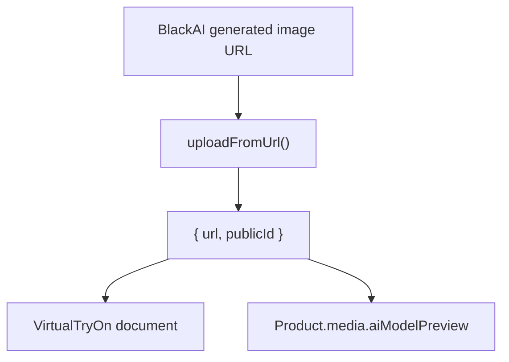
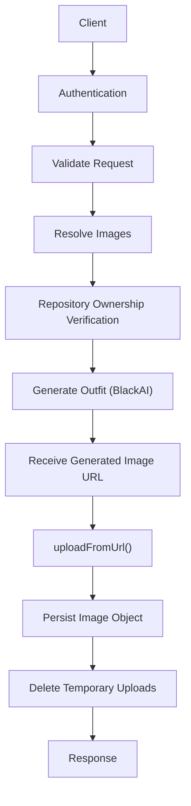

# Virtual Try-On API

## Endpoint

```http
POST /api/v1/virtual-try-on/outfit
```

## Authentication

Authentication is required.

Supported authentication methods:

- Bearer Token
- Session Cookie

## Request Type

```text
multipart/form-data
```

## Supported Roles

The endpoint supports two authenticated roles:

- `USER`
- `SELLER`

The controller automatically routes the request to the appropriate service based on the authenticated user's role.

## User Request

### Required Fields

| Field | Required |
| --- | :---: |
| `prompt` | Yes |
| `ratio` | Yes |
| `cloth1Id` **or** `cloth1` | Yes |
| `cloth2Id` **or** `cloth2` | Yes |

### Optional Fields

| Field |
| --- |
| `cloth3Id` |
| `cloth3` |
| `modelPhoto` |

If `modelPhoto` is not provided, the authenticated user's profile image is used.

## Seller Request

### Required Fields

| Field | Required |
| --- | :---: |
| `prompt` | Yes |
| `ratio` | Yes |
| `productId1` | Yes |
| `aiModelId` **or** `modelPhoto` | Yes |

### Optional Fields

| Field |
| --- |
| `productId2` |
| `productId3` |
| `cloth1` |
| `cloth2` |
| `cloth3` |

## Validation Rules

### Model Image Resolution

#### User

A model image is resolved using the following priority:

1. Uploaded `modelPhoto`
2. User profile image

If neither exists, the request is rejected.

#### Seller

A model image is resolved using the following priority:

1. Uploaded `modelPhoto`
2. Existing `aiModelId`

If neither exists, the request is rejected.

#### Seller Primary Product

`productId1` is required.

Uploaded clothing images do not replace the requirement for a primary existing product.

This guarantees the generated preview can always be permanently associated with a product.

### Clothing & Product Images

Each image slot accepts only one source.

Valid examples:

```text
cloth1
OR
cloth1Id
```

```text
cloth2
OR
cloth2Id
```

```text
cloth3
OR
cloth3Id
```

The Seller flow follows the same "one source per clothing slot" rule.


For example:
```text
cloth2
OR
productId2

cloth3
OR
productId3
```

Providing both a file and an existing document ID for the same slot results in a validation error.

## User Business Rules

- Every `ClothingItem` must belong to the authenticated user.
- Uploaded model images always take priority over the user's profile image.
- Temporary Cloudinary uploads are deleted after processing.

A successful request:

1. Generates an outfit using `BlackAI`
2. Receives the generated image URL
3. Uploads the generated image to Cloudinary through `uploadFromUrl()`
4. Converts the Cloudinary upload response into the application's image object
5. Stores that image object inside the `VirtualTryOn` document
6. Deletes all temporary uploads

## Seller Business Rules

- Every `Product` must belong to the authenticated seller.
- `productId1` is required for every Seller request.
- At least one existing product participates in every Seller virtual try-on generation.
- Product images may be supplied either as uploads or existing Product IDs.
- Uploaded model images always take priority over an existing AI Model.
- The generated AI preview is stored only on the primary `Product`.
- Temporary Cloudinary uploads are deleted after processing.

A successful Seller request stores the generated image object inside `Product.media.aiModelPreview`.

## Product Validation

Whenever a `Product` is created or updated:

- Only one fit section may contain values.
- The selected product type must match the populated fit section.
- Invalid fit combinations are rejected before the document is saved.

## Generated Image Storage

After `BlackAI` returns the generated outfit URL, it is immediately uploaded to Cloudinary.

`uploadFromUrl()` uploads the generated image to Cloudinary.

`uploadFromUrl()` also converts Cloudinary's response into the application's image object:

```ts
{
  url,
  publicId
}
```

This object is what gets persisted.

### Persistence Target by Role

| Role | Persistence target |
| --- | --- |
| `USER` | `VirtualTryOn.virtualTryOnImage` |
| `SELLER` | `Product.media.aiModelPreview` |

In the current implementation, the User flow stores the generated image under `virtualTryOnImage`, while the Seller flow stores it inside `Product.media.aiModelPreview`.



## Success Response

```json
{
  "statusCode": 200,
  "data": {
    "_id": "...",
    "owner": "...",
    "cloth1": "...",
    "cloth2": "...",
    "cloth3": "...",
    "virtualTryOnImage": {
      "url": "...",
      "publicId": "..."
    },
    "createdAt": "...",
    "updatedAt": "..."
  },
  "message": "Virtual try on generated successfully"
}
```

The shape of `data` depends on the authenticated role.

| Role | Response |
| --- | --- |
| `USER` | Newly created `VirtualTryOn` document |
| `SELLER` | Updated `Product` containing the generated AI preview |

## Error Responses

### 400 Bad Request

Examples:

- Missing required images
- Both uploaded file and document ID supplied for the same slot
- Invalid prompt
- Invalid aspect ratio
- Invalid product fit data

### 401 Unauthorized

Returned when the request is not authenticated.

### 404 Not Found

Examples:

- `ClothingItem` not found
- `Product` not found
- `AI Model` not found
- Resource does not belong to the authenticated owner

### 500 Internal Server Error

Returned when an unexpected server error occurs.

## Request Processing Flow

```text
Client
    |
    v
Authentication
    |
    v
Validate Request
    |
    v
Resolve Images
    |
    v
Repository Ownership Verification
    |
    v
Generate Outfit (BlackAI)
    |
    v
Receive Generated Image URL
    |
    v
uploadFromUrl()
    |
    v
Persist Image Object
    |
    v
Delete Temporary Uploads
    |
    v
Response
```



## Notes

> [!NOTE]
> Uploaded images are treated as temporary resources unless they become part of a permanent document.

> [!NOTE]
> Ownership validation is enforced inside repositories.

> [!NOTE]
> Image resolution is handled by dedicated resolvers, allowing services to remain independent of image sources.

> [!NOTE]
> `uploadFromUrl()` hides Cloudinary's raw response and returns the application's image object instead.

> [!NOTE]
> Temporary Cloudinary uploads are deleted in a `finally` block, ensuring cleanup even when generation fails.

> [!TIP]
> Generated images become permanent Cloudinary assets.

> [!TIP]
> Temporary uploads are always deleted in `finally`.

> [!TIP]
> Repositories remain independent from external services.

> [!TIP]
> BlackAI only returns the generated image URL.

> [!TIP]
> Cloudinary owns the permanent generated image.
